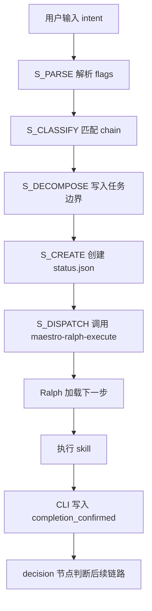

# Maestro 工作流百科网站设计草案

## 推荐方向

在主仓库建设独立的 Vite + React 百科站。`maestro-flow` 子模块只作为内容参考，不复用其 `docs-site`，避免产品定位被原项目文档站约束。第一版用 React state + SVG 实现可点击流程图节点，后续再评估是否引入专用 graph/flow 库。

## 信息架构

### 1. 首页：我该用哪个命令？

- 输入框：用户描述当前任务。
- 快捷卡片：探索想法、生成规格、分析代码、制定计划、执行实现、质量检查、查看状态。
- 输出区：推荐命令、推荐链路、推荐理由、需要澄清的问题。

### 2. Maestro 运行流程

- 展示 `maestro` 编排状态机，节点必须可点击和键盘访问。
- 重点解释：分类、分解、创建 session、交给 Ralph 执行。
- 强调 `status.json` 是唯一真源。
- 点击节点时在详情面板展示输入、输出、执行责任和常见误区。

### 3. 命令地图

- 按生命周期分组：探索层、规格层、分析层、计划层、执行层、质量层、知识层。
- 每个命令展示适用场景、典型输入、输出产物和下一步。

### 4. Ralph Session 解剖

- 展示 `status.json` 示例。
- 逐字段解释 `steps[]`、`command_path`、`decision`、`completion_confirmed`、`task_decomposition`。
- 提供“从 session 看下一步”的示例。

### 5. 案例库

- 从“我要做一个新功能”到推荐 `brainstorm -> blueprint -> analyze -> plan -> execute`。
- 从“修一个 bug”到推荐 `debug` 或 `quality-debug`。
- 从“继续项目”到推荐 `continue/next/go` 的 state-based routing。

## 命令推荐 Agent 设计

第一阶段建议使用纯前端规则引擎，避免引入后端和密钥管理复杂度。

### 输入

- 用户自然语言需求。
- 可选 flags：`-y`、`--dry-run`、`--continue`、`--super`。
- 可选项目状态：用户粘贴或上传简化后的 `status.json`。

### 输出

- `recommended_command`：推荐命令。
- `chain_name`：推荐链路。
- `confidence`：high、medium、low。
- `classification_rationale`：匹配了哪些 pattern，排除了哪些备选。
- `clarifying_questions`：最多 3 个问题。

### 规则示例

- 用户表达“探索、想法、还不明确”时推荐 `maestro-brainstorm`。
- 用户表达“正式规格、PRD、blueprint”时推荐 `maestro-blueprint`。
- 用户表达“继续、下一步、go”时推荐 state-based routing。
- 用户表达“状态、dashboard”时推荐 `manage-status`。
- 用户表达“压力测试、拷问、验证假设”时推荐 `maestro-grill`；自动模式下推荐 `maestro-brainstorm`。

## 交互流程图草案

第一版不使用静态 Mermaid 作为主交互层，而使用 SVG 节点加 React 状态管理。Mermaid 可作为文章中的辅助静态图，但核心流程图必须支持节点点击、键盘选择和详情面板联动。

## 实施建议

### 阶段 1：内容与导航

- 建立主仓库独立 Vite + React 应用。
- 增加中文百科首页和命令地图。
- 增加 Maestro 可交互状态机流程图。

### 阶段 2：推荐器 MVP

- 实现纯前端规则引擎。
- 提供推荐理由和澄清问题。
- 增加 10 个典型用户场景测试样例。

### 阶段 3：Session 示例与交互

- 增加 `status.json` 示例浏览器。
- 支持粘贴 session JSON 后解释下一步。
- 增加流程节点点击展开说明。

### 阶段 4：可选 Agent 接入

- 在有明确后端和密钥管理方案后接入 LLM。
- LLM 输出必须映射到固定 schema，前端展示置信度和理由。

## 技术约束

- Vite dev server 需要配置 `server.allowedHosts` 包含 `.monkeycode-ai.online` 以支持预览域名。
- Mermaid label 不使用换行，包含特殊字符时使用双引号。
- 推荐器第一阶段运行在浏览器端，避免服务端依赖。
- submodule 内变更需要遵循 submodule 单独分支和提交流程。
