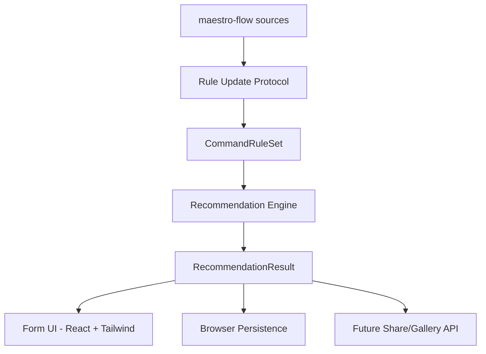

# Architecture Index

## Components (revised for form-driven shape)

> **2026-06-30 更新**：Canvas UI 已被 ADR-006 取代为 Form UI。

## ADRs

| ID | Title | Status | Notes |
|---|---|---|---|
| ADR-001 | Local CommandRuleSet Layer | accepted | 锚点已修订（2026-06-30） |
| ~~ADR-002~~ | ~~Branch-Aware Canvas State~~ | **superseded by ADR-006** | 数据层 + 渲染层均作废 |
| ADR-003 | Browser Persistence and Future Sharing Boundary | accepted | |
| ADR-004 | Source Provenance and LLM Update Protocol | accepted | |
| ADR-005 | React Flow 技术栈迁移 | **partially superseded by ADR-006** | 技术栈选型有效，推荐交互 canvas 部分作废 |
| ADR-006 | 表单驱动形态取代 Canvas 中心 | accepted | 2026-06-30 新增 |
