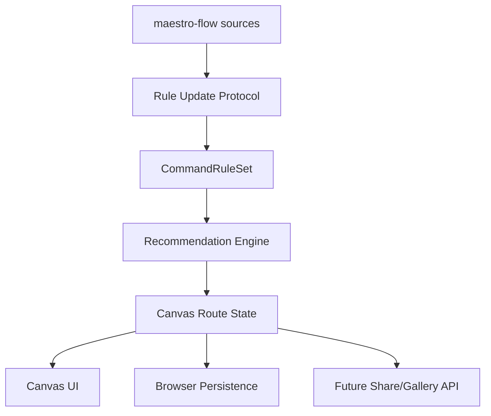

# Architecture Index

## Components

## ADRs

| ID | Title | Status |
|---|---|---|
| ADR-001 | Local CommandRuleSet Layer | accepted |
| ADR-002 | Branch-Aware Canvas State | accepted |
| ADR-003 | Browser Persistence and Future Sharing Boundary | accepted |
| ADR-004 | Source Provenance and LLM Update Protocol | accepted |
