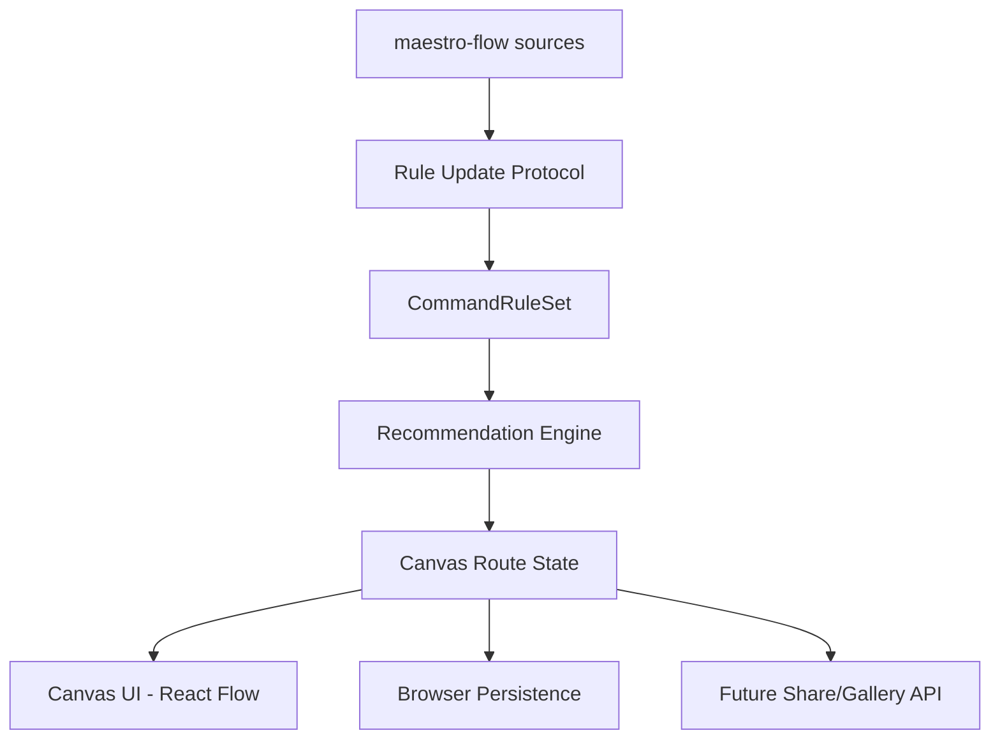

# Architecture Index

## Components

> **2026-06-30 更新**：Canvas UI 已从 SVG 自研迁移到 @xyflow/react（见 ADR-005）。

## ADRs

| ID | Title | Status | Notes |
|---|---|---|---|
| ADR-001 | Local CommandRuleSet Layer | accepted | 锚点已修订（2026-06-30） |
| ADR-002 | Branch-Aware Canvas State | accepted | 数据层有效；渲染层被 ADR-005 取代 |
| ADR-003 | Browser Persistence and Future Sharing Boundary | accepted | |
| ADR-004 | Source Provenance and LLM Update Protocol | accepted | |
| ADR-005 | React Flow 技术栈迁移 | accepted | 2026-06-30 新增 |
