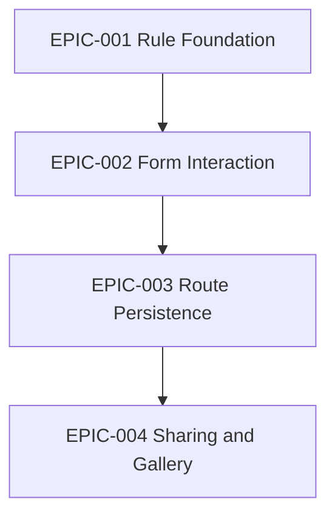

# Epics Index

| Epic | Title | MVP | Notes |
|---|---|---|---|
| EPIC-001 | Rule Foundation | yes | 不变 |
| EPIC-002 | ~~Canvas Interaction~~ Form Interaction | yes | 2026-06-30 重写（ADR-006） |
| EPIC-003 | Route Persistence | yes | 不变 |
| EPIC-004 | Sharing and Gallery | no | 不变 |

## Dependency Map

