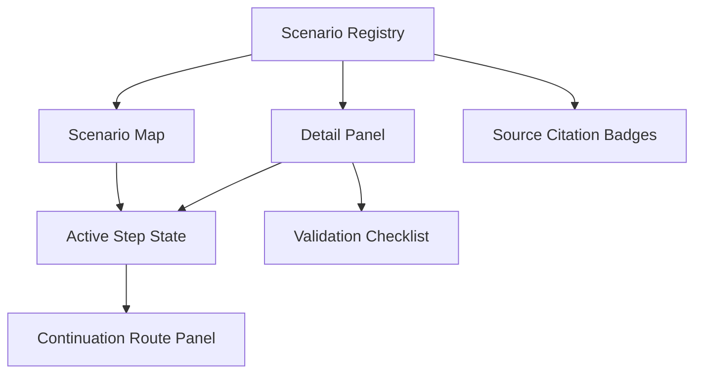
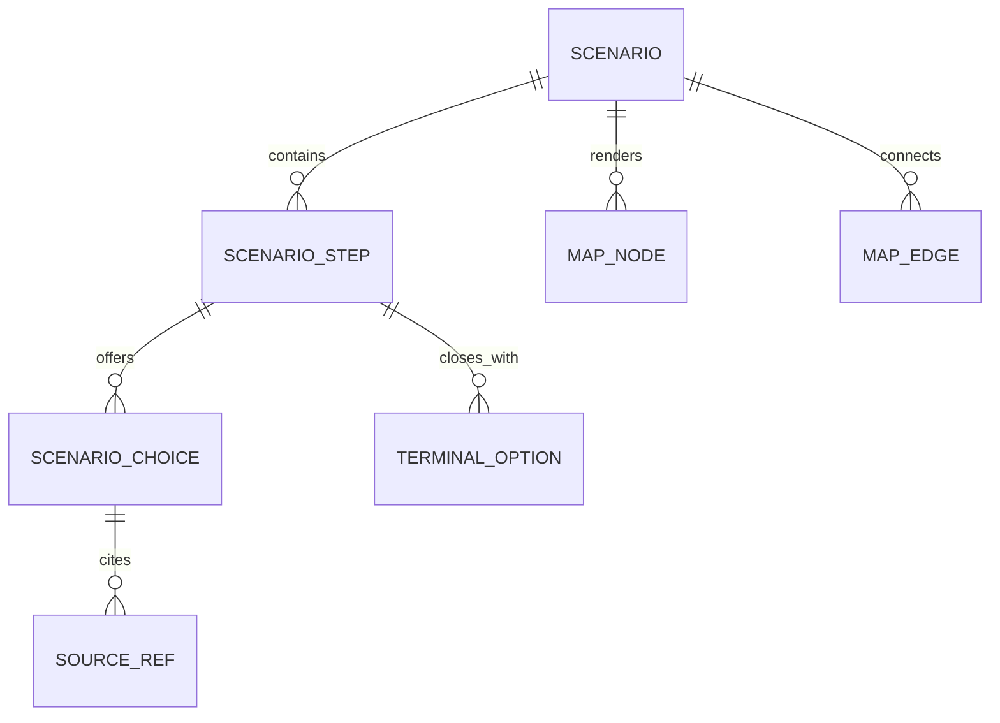

# Architecture Overview

## Architecture Style

The feature set uses a client-side data-driven React architecture. Scenario data is separated from rendering components, and UI state derives from the active scenario and step.

## Components



## Data Model



## State Machine

```
Idle -> ScenarioSelected -> StepActive -> ChoiceSelected -> StepActive
                                      \-> ClosingNode -> Stop
                                      \-> ClosingNode -> ContinuationRoute
```

| State | Trigger | Next |
|---|---|---|
| Idle | user selects scenario | ScenarioSelected |
| ScenarioSelected | scenario loads first step | StepActive |
| StepActive | user selects next command choice | ChoiceSelected |
| ChoiceSelected | target is another step | StepActive |
| ChoiceSelected | target is terminal option | ClosingNode |
| ClosingNode | user stops | Stop |
| ClosingNode | user chooses continuation | ContinuationRoute |

## Configuration Model

| Field | Type | Default | Constraint |
|---|---|---|---|
| activeScenarioId | string | first scenario | MUST reference scenario registry |
| activeStepId | string | first step | MUST reference active scenario |
| selectedNodeId | string | first node | SHOULD map to active step |
| citationStatus | enum | pending | cited, pending, not-required |

## Error Handling

| Error | Classification | Recovery |
|---|---|---|
| Missing target step | permanent content error | fail fast in validation; show fallback copy in UI |
| Missing source citation | degraded content quality | show pending citation badge |
| Unknown scenario ID | permanent state error | reset to first scenario |

## Observability

For MVP, observability is local/manual. Future analytics MAY track scenario selected, step reached, validation checklist completion, citation pending count, and keyboard navigation coverage.

## ADR Index

| ADR | Decision | Requirements |
|---|---|---|
| ADR-001 | Data-driven Scenario Model | REQ-001, REQ-002, REQ-003 |
| ADR-002 | Detail Panel for Secondary Routes | REQ-004, NFR-UX-001 |
| ADR-003 | Source Citation Layer | REQ-005, NFR-MAINT-001 |
| ADR-004 | Local-only Validation Checklist | REQ-006 |
