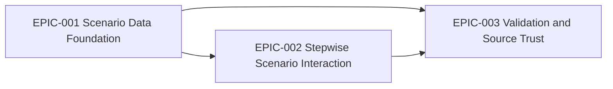

# Epics Index

## Epic Table

| Epic | Title | MVP | Requirements |
|---|---|---|---|
| EPIC-001 | Scenario Data Foundation | yes | REQ-001, REQ-005, NFR-MAINT-001 |
| EPIC-002 | Stepwise Scenario Interaction | yes | REQ-002, REQ-003, REQ-004, NFR-UX-001, NFR-A11Y-001 |
| EPIC-003 | Validation and Source Trust | yes | REQ-005, REQ-006, NFR-MAINT-001 |

## Dependency Map

## Recommended Execution Order

1. EPIC-001 establishes scenario data shape and source metadata.
2. EPIC-002 uses that model to build active scenario slice and command-choice UI.
3. EPIC-003 validates comprehension and source trust after the core loop works.

## MVP Definition of Done

- One unclear-requirements Scenario Slice is implemented.
- Users can choose first and subsequent commands through described output conditions.
- Closing node shows stop, quality, and knowledge continuation choices.
- Scenario command facts are cited or clearly marked pending citation.
- Internal validation checklist confirms command-sequence comprehension.
